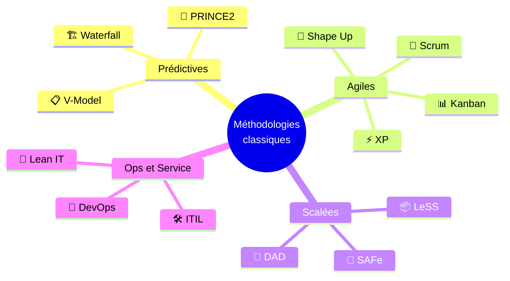
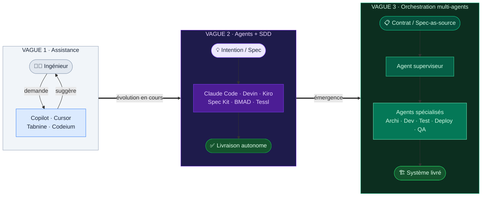
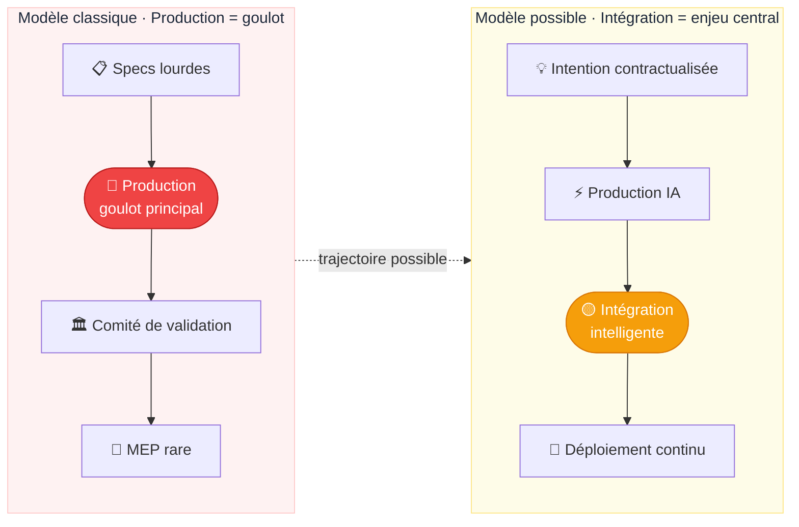
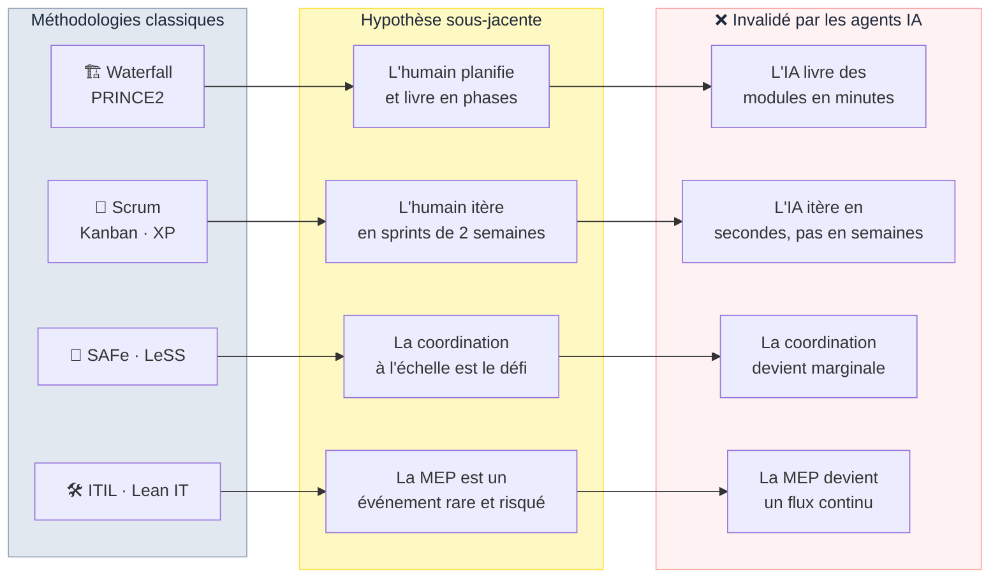
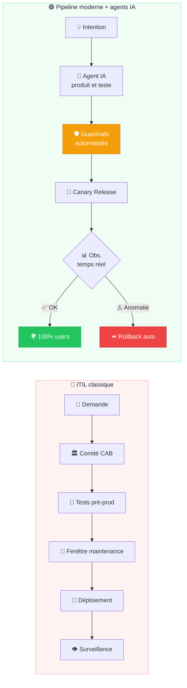
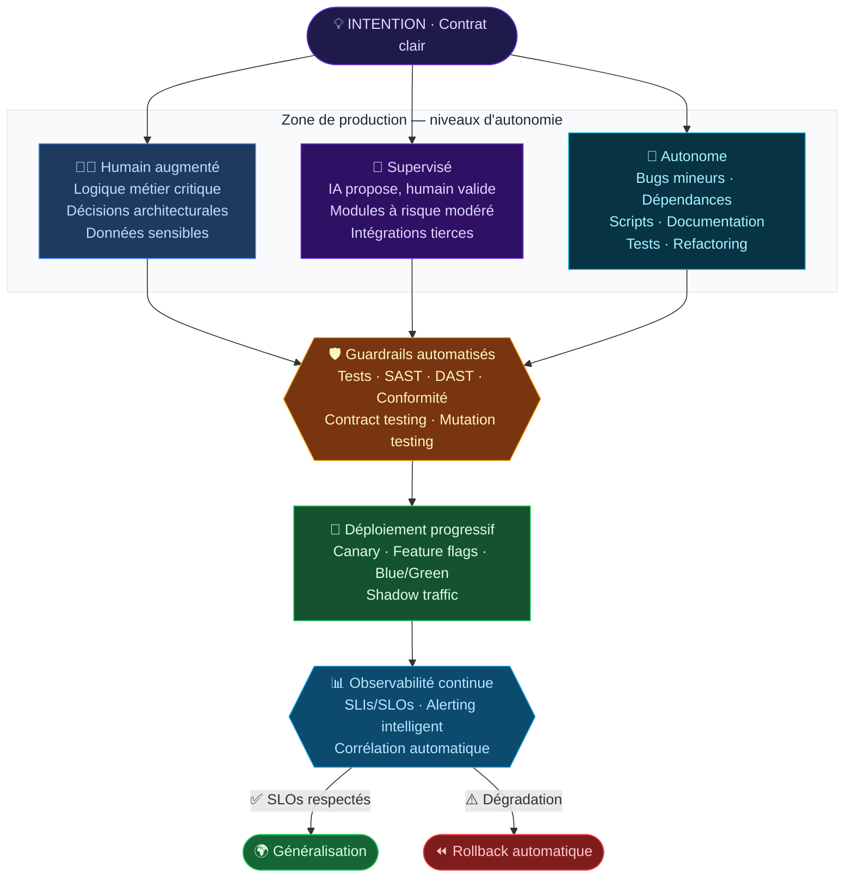
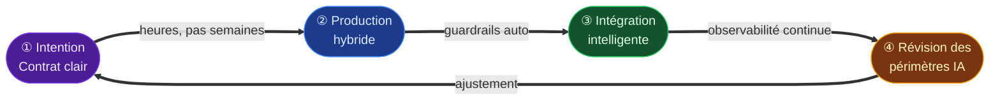
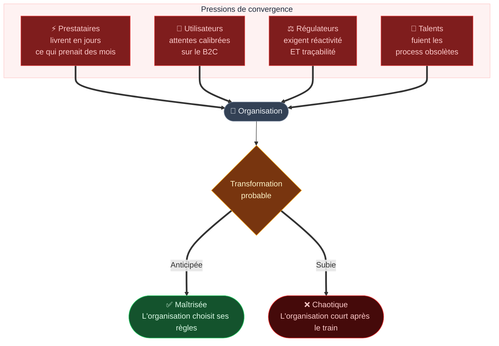

**Languages**  
- 🇬🇧 English [README.md](README.md)
- 🇫🇷 Version française: (ce document)  

# Vers quoi converger ? La gestion de projets à l'ère des agents IA

> *Document de réflexion ouverte — Février 2026*
> *Ce texte ne prétend pas apporter une réponse définitive. Il propose une direction et invite à la discussion.*

---

## En résumé

Les méthodologies dominantes de gestion de projets — Waterfall, Scrum, SAFe, ITIL, Kanban, DevOps — reposent toutes sur une hypothèse fondatrice : **l'humain est l'auteur du code, et produire prend du temps**. Les agents IA (Claude Code, Devin, Antigravity, Cursor Agent, SWE-agent…) invalident progressivement cette hypothèse. Non pas demain — aujourd'hui, dans un nombre croissant d'équipes.

En observant ces évolutions, trois déplacements fondamentaux semblent se dessiner :

1. **De la spécification exhaustive → vers l'intention claire et contractualisée**
2. **De la validation préalable → vers l'observabilité continue et les guardrails automatisés**
3. **Du sprint cadencé → vers le flux continu à niveaux d'autonomie différenciés**

Cette direction n'est pas un cadre rigide. C'est une **hypothèse de travail** — une réflexion personnelle sur ce qui pourrait émerger, nourrie par l'observation de ce qui se passe déjà sur le terrain.

---

## 1. Le constat : pourquoi les méthodologies actuelles atteignent leurs limites

### 1.1 L'hypothèse fondatrice qui vacille

Toutes les méthodologies de gestion de projet — qu'elles soient prédictives, agiles, scalées ou orientées ops — ont été conçues dans un monde où la **production est le goulot d'étranglement**. Chaque cérémonie, chaque artefact, chaque processus de validation existe parce que le temps de développement est rare et coûteux. Planifier, estimer, prioriser, valider : autant de mécanismes d'optimisation d'une ressource limitée — le temps humain de production.

Toutes ces approches — aussi différentes soient-elles — partagent une **hypothèse fondamentale commune** : l'humain est l'auteur du code, et produire prend du temps. L'émergence des agents IA remet cette hypothèse en question de façon radicale.

### 1.2 De l'assistance à l'autonomie — une trajectoire déjà engagée

La première vague d'IA dans le développement était celle de l'**assistance** : autocomplétion, suggestion de code, génération de fonctions isolées. L'outil restait entièrement sous contrôle de l'ingénieur — un accélérateur, pas un acteur.

La deuxième vague, déjà concrète, est celle des **agents autonomes** : des systèmes capables de comprendre une intention, décomposer un problème en sous-tâches, écrire du code, exécuter des tests, corriger les erreurs, et déclencher un pipeline de déploiement — le tout sans intervention humaine directe à chaque étape. Des équipes utilisent aujourd'hui Claude Code, Devin, Antigravity, Aider ou Continue.dev pour produire et déployer des modules entiers de manière autonome.

Cette vague s'accompagne de l'émergence d'un nouveau paradigme méthodologique : le **Spec-Driven Development (SDD)** — le développement piloté par les spécifications. L'intuition est simple : si l'IA génère le code, alors **la spécification devient l'artefact principal** — le seul artefact que les humains maintiennent réellement. Le code n'est plus que l'expression d'une spec dans un langage et un framework donnés. C'est un renversement fondamental : dans le développement classique, la spec finit toujours par diverger du code. Dans un monde SDD, la spec *est* la source de vérité, et le code en dérive.

Un article de référence de Birgitta Böckeler (Thoughtworks/Martin Fowler) distingue utilement **trois niveaux de maturité SDD** : *spec-first* (la spec est écrite avant le code), *spec-anchored* (la spec est maintenue après la livraison pour l'évolution), et *spec-as-source* (la spec est le seul artefact édité par les humains). La majorité des équipes se situent aujourd'hui au premier niveau, mais la trajectoire semble claire.

Plusieurs approches concrètes matérialisent déjà ce paradigme :

- **GitHub Spec Kit** (open source, sept. 2025) — Un toolkit agent-agnostique qui structure le workflow en étapes : *Constitution* → *Specify* → *Plan* → *Tasks* → *Implement*. Compatible avec Claude Code, Copilot, Cursor, Gemini CLI et d'autres.

- **BMAD Method** (open source, v6) — *Breakthrough Method for Agile AI-Driven Development*. Orchestre une **équipe virtuelle d'agents spécialisés** (Analyst, PM, Architect, Dev, QA) selon le paradigme *Agent-as-Code*, en générant des artefacts versionnés qui servent de source de vérité partagée entre humains et agents.

- **Amazon Kiro** (GA, fin 2025) — Un IDE agentique qui intègre le SDD nativement. Transforme un prompt en spécifications structurées, puis orchestre des agents pour l'implémentation avec *hooks* et *property-based testing*.

- **Tessl Framework** (beta, $125M levés) — Pousse le SDD vers sa forme la plus radicale : le **spec-as-source**, où le code est entièrement généré et les humains n'éditent que les specs.

Une troisième vague se profile déjà au-delà du SDD : celle des **orchestrations multi-agents**, où plusieurs agents spécialisés collaborent sur des tâches complexes — un agent architecte, un agent développeur, un agent testeur, un agent déployeur — coordonnés par un agent superviseur ou par des contrats d'interface déclaratifs. BMAD en est déjà une incarnation concrète.

### 1.3 Le déplacement du goulot d'étranglement

Dans le modèle classique, le goulot se trouve dans la **production**. Les méthodologies existent pour optimiser ce temps rare et coûteux.

Avec les agents IA, le goulot se déplace vers **l'intégration, la validation et la gouvernance**. La production devient rapide et peu coûteuse. Ce qui coûte cher, c'est de s'assurer que ce qui est produit est correct, sûr, conforme, et qu'il s'intègre sans régression dans un système existant.

Ce déplacement a une conséquence directe : **les cérémonies de coordination deviennent disproportionnées** face au rythme de production. Les cérémonies agile — sprint planning, refinement, review, retrospective — représentent désormais une proportion disproportionnée du temps total, créant une inversion paradoxale : *les processus de coordination coûtent plus cher que le travail lui-même*. Et quand une partie de ce travail est accomplie de manière autonome par un agent IA pendant que l'équipe est en réunion de planification, l'absurdité devient visible.

### 1.4 Une inadéquation structurelle, méthodologie par méthodologie

Chaque méthodologie classique repose sur des hypothèses que les agents IA invalident :

### 1.5 ITIL : cas emblématique de l'inadaptation

ITIL a été pensé pour des environnements stables où la mise en production est un événement rare et potentiellement risqué. Son processus de Change Management repose sur l'hypothèse que déployer est coûteux à défaire.

Or, si une infrastructure moderne permet de déployer plusieurs fois par jour avec des mécanismes de rollback automatique et une observabilité en temps réel, l'approbation préalable d'un comité de changement devient un frein structurel sans valeur ajoutée proportionnelle.

Ce n'est pas qu'ITIL est inadapté par nature — c'est que ses hypothèses fondatrices ne correspondent plus au terrain tel qu'il évolue. Le même raisonnement s'applique, à des degrés divers, à chacune des méthodologies classiques.

---

## 2. La direction de convergence : Spec-Light, Guardrail-Heavy

Face à cette rupture, il me semble que les organisations n'ont pas tant besoin d'une nouvelle méthodologie prescriptive que d'un **vecteur de convergence** — un ensemble de principes directeurs qui pourraient orienter l'évolution des pratiques, quel que soit le point de départ.

Ce vecteur tient en une formule :

> **Moins de friction à la production → Plus d'intelligence à l'intégration**

La confiance ne serait plus accordée par un comité en amont. Elle serait **construite par la preuve automatisée et l'observabilité en temps réel**.

### 2.1 Cinq déplacements qui semblent se dessiner

| Déplacement | En pratique |
|------------|------------|
| Spécification exhaustive → **intention claire** | Définir le *quoi* et le *pourquoi*, pas le *comment* |
| Validation préalable → **observabilité continue** | Détecter en 5 min, rollback en 2 min > valider pendant 3 semaines |
| Revues manuelles → **guardrails automatisés** | Tests, SAST, DAST, conformité comme gates non contournables |
| Tout-humain → **autonomie graduée par le risque** | Chaque composant a un niveau d'autonomie explicite |
| Sprint cadencé → **flux continu** | La cadence dépend de la capacité d'intégration, pas des cérémonies |

### 2.2 Trois niveaux de production coexistants

La convergence ne signifie pas tout déléguer aux agents. Elle implique de **différencier explicitement les niveaux d'autonomie** en fonction du risque, de la criticité métier et de la maturité des guardrails disponibles.

Le niveau d'autonomie dépendrait de facteurs comme l'impact métier d'une erreur, la sensibilité des données, la facilité de rollback, la couverture de tests et la complexité de la logique métier.

---

## 3. Les piliers opérationnels d'un tel modèle

### 3.1 Le contrat d'intention — spécifier mieux, pas moins

Le passage des spécifications exhaustives aux contrats d'intention n'est pas une simplification — c'est un **changement de nature**. Un contrat d'intention définirait l'objectif métier, les contraintes non négociables, le niveau d'autonomie accordé et les critères d'acceptation observables. Ce qui disparaît : les documents de conception de 80 pages. Ce qui les remplace : un contrat compact, actionnable par un humain *et* par un agent IA. Durée de rédaction : heures, pas semaines.

### 3.2 Les guardrails automatisés — la confiance par la preuve

Dans un modèle où des agents produisent du code de manière autonome, les guardrails ne sont pas un luxe — ils sont la **condition d'existence** du modèle. Sans eux, l'autonomie est du chaos déguisé. Qualité du code, correction fonctionnelle, robustesse, sécurité, conformité, compatibilité : autant de couches automatisées qui forment une chaîne de confiance. L'échec d'un guardrail bloque le déploiement — sans exception.

### 3.3 L'observabilité comme gouvernance

Le déplacement le plus profond : dans les méthodologies classiques, on contrôle *avant* de déployer. Ici, on contrôlerait *pendant et après* — SLIs/SLOs, alerting intelligent, rollback automatique, audit trail complet.

> Si l'on peut détecter un problème en 5 minutes et revenir en arrière en 2 minutes, l'exigence de validation préalable exhaustive perd l'essentiel de sa justification.

### 3.4 La documentation vivante

La documentation pourrait être **générée automatiquement** par les agents — ADR, changelogs, documentation d'API, journaux de décision. Cette dernière catégorie est nouvelle : elle répond au **risque de boîte noire** inhérent à la production autonome.

---

## 4. Le cycle opérationnel — quatre phases, un flux continu

**① Intention** — Définir le problème métier, le résultat attendu, les contraintes et le niveau d'autonomie. C'est la seule entrée du cycle. Une intention floue ne se compense pas par une production rapide.

**② Production hybride** — Trois modes coexistent selon le risque : humain augmenté, supervisé, autonome. Pas de timebox arbitraire — la production se termine quand l'intention est réalisée et les guardrails satisfaits.

**③ Intégration intelligente** — La validation porte sur les *résultats observés*, pas sur les *plans prévisionnels*. Déploiement progressif : canary releases, feature flags, blue/green.

**④ Révision périodique des périmètres IA** — Régulièrement, l'équipe réévalue les périmètres d'autonomie. Ce qui fonctionne est élargi. Ce qui dérive est repris en main. C'est le garde-fou contre la normalisation silencieuse de l'autonomie.

---

## 5. La transition : un modèle intermédiaire, pas utopique

Ce modèle n'est pas un état final idéalisé. C'est une **hypothèse de transition** — qui pourrait fonctionner avec les professionnels d'aujourd'hui, tout en préparant le terrain pour les pratiques de demain.

L'arrivée des agents IA ne change pas seulement les pratiques — elle redessine le paysage des compétences. On voit déjà se profiler des rôles nouveaux : architectes d'intentions, ingénieurs guardrails, superviseurs d'agents, ingénieurs observabilité. Cette transformation ne sera ni instantanée ni linéaire — mais elle est déjà amorcée.

---

## 6. Les risques — lucidité nécessaire

Toute réflexion sérieuse sur ce sujet gagne à intégrer ses propres angles morts.

**La dette de compréhension métier.** Des spécifications légères peuvent produire des applications techniquement cohérentes mais **métier-incohérentes**. Dans des contextes sensibles — calcul de droits sociaux, données personnelles, décisions à impact humain — une erreur de logique métier n'est pas rattrapable par un rollback technique. La légèreté des specs gagnerait à être compensée par une collaboration métier continue, pas éliminée.

**Les contraintes réglementaires.** LPD/RGPD, traçabilité des décisions algorithmiques, AI Act : ces obligations ne disparaissent pas avec l'accélération. Elles gagneraient à être intégrées dans les guardrails eux-mêmes.

**La responsabilité.** Quand un agent produit et déploie du code, qui porte la responsabilité en cas d'incident ? Il semble raisonnable que l'équipe ayant défini le périmètre d'autonomie reste responsable. L'autonomie IA ne serait pas une exonération — mais une délégation encadrée.

**Le risque de la boîte noire.** Un agent peut générer du code fonctionnel dont la logique est difficile à auditer. Sans traçabilité, une **dette de lisibilité** silencieuse s'accumule.

**Le risque de sur-confiance.** Le danger le plus insidieux : quand les équipes cessent de questionner les décisions des agents parce que "ça marche depuis 6 mois".

---

## 7. La pression externe — pourquoi le statu quo semble difficile à tenir

Même les organisations qui souhaiteraient ne rien changer se trouveraient probablement sous pression — non par conviction, mais par **convergence de forces externes**.

L'histoire des révolutions technologiques précédentes — web, cloud, mobile, DevOps — suggère un pattern récurrent : **les organisations qui anticipent tendent à définir les nouvelles règles. Celles qui subissent affrontent souvent une transformation forcée dans des conditions défavorables.**

Quelques forces concrètes qui me semblent difficiles à ignorer :

**Les prestataires et fournisseurs accélèrent.** Les éditeurs de logiciels, les intégrateurs et les startups concurrentes adoptent ces nouveaux rythmes. Les organisations conservatrices se retrouveront à négocier avec des partenaires qui livrent en jours ce qu'elles planifient en trimestres.

**Les attentes des utilisateurs évoluent.** Les collaborateurs et clients habitués aux produits numériques grand public accepteront de moins en moins l'écart entre l'expérience numérique du quotidien et les outils internes de l'organisation.

**La pression réglementaire elle-même évolue.** Les régulateurs commencent à exiger des capacités de réaction rapide : correction de failles en heures, adaptation à de nouvelles lois en semaines. Un cycle de release semestriel rend ces exigences difficiles à tenir.

**Le marché du talent se déplace.** Les ingénieurs formés aux pratiques modernes refuseront progressivement des environnements figés dans des processus archaïques. Les organisations lentes à évoluer risquent de perdre leurs meilleurs profils.

Les organisations qui résistent accumulent ce qu'on pourrait appeler une **dette de transformation** — qui rendrait la transition future d'autant plus coûteuse et douloureuse.

La question est peut-être moins "si" que "comment" et "à quel rythme".

---

## 8. Et maintenant ?

Ce document ne prescrit rien. Il pose une question et esquisse une direction possible.

Si cette réflexion a un mérite, c'est peut-être celui de nommer ce qui se passe déjà sous nos yeux : les agents IA changent la donne, et les méthodologies conçues pour un monde où l'humain est l'auteur exclusif du code vont devoir évoluer. La forme exacte de cette évolution reste ouverte.

La direction **Spec-Light, Guardrail-Heavy** n'est qu'une hypothèse parmi d'autres. D'autres patterns émergeront, portés par des équipes qui expérimentent aujourd'hui sans attendre qu'un framework leur dise comment faire. C'est probablement là que se trouvent les meilleures réponses — dans la pratique, pas dans la théorie.

Ce qui me semble difficile à contester, en revanche, c'est que **le statu quo a une date de péremption**. La question n'est pas *si* les choses vont changer, mais *comment* — et à quel rythme chaque organisation est prête à le faire.

---

## Conclusion — une réflexion, pas une prescription

Les méthodologies actuelles de gestion de projets ont été excellentes pour leur époque. Mais elles reposent sur une hypothèse qui est en train d'être mise à l'épreuve : *produire est lent et coûteux, et l'humain est toujours l'auteur*.

Les agents IA — Copilot, Cursor, Claude Code, Devin, Antigravity et leurs successeurs — invalident progressivement cette double hypothèse. Non seulement ils accélèrent la production humaine, mais ils commencent à produire et déployer de manière autonome des portions entières de code. Cette tendance va probablement s'amplifier.

La direction esquissée ici — **Spec-Light, Guardrail-Heavy** — n'est pas un framework de plus à empiler sur les existants. C'est une réflexion sur un possible changement de paradigme : déplacer les leviers de contrôle de la validation préalable vers l'observabilité continue, de la spécification exhaustive vers l'intention claire, du comité de changement vers les guardrails automatisés, et de la supervision de chaque ligne de code vers la gouvernance des périmètres d'autonomie.

Le vrai défi sera probablement **culturel autant que technique** : accepter que la confiance se gagne par la réversibilité et l'observabilité plutôt que par l'approbation préalable — que le code soit écrit par un ingénieur ou par un agent IA.

Ce modèle est intentionnellement **intermédiaire** : il fonctionnerait avec les professionnels d'aujourd'hui, dans les organisations telles qu'elles sont, tout en traçant un chemin vers les pratiques de demain. Il ne prétend pas être la seule direction possible — ni nécessairement la bonne. Mais il me semble qu'une direction **délibérée, progressive et réversible** vaut mieux que l'absence de réflexion.

La question mérite d'être posée. Et peut-être que d'autres proposeront de meilleures réponses.

*Ce document est une base de réflexion ouverte destinée à alimenter une discussion sur l'évolution des pratiques de gestion de projets à l'ère des agents IA.*

---

> **Note de l'auteur**
>
> Si vous êtes arrivés à ce paragraphe, alors même si cette réflexion n'est pas la bonne, la question mérite d'être posée. Ce document n'est ni dogme ni prophétie. C'est une réflexion personnelle, imparfaite, sur un territoire en formation. Si vous avez une meilleure analyse ou un meilleur pattern à proposer, le dialogue est ouvert.
