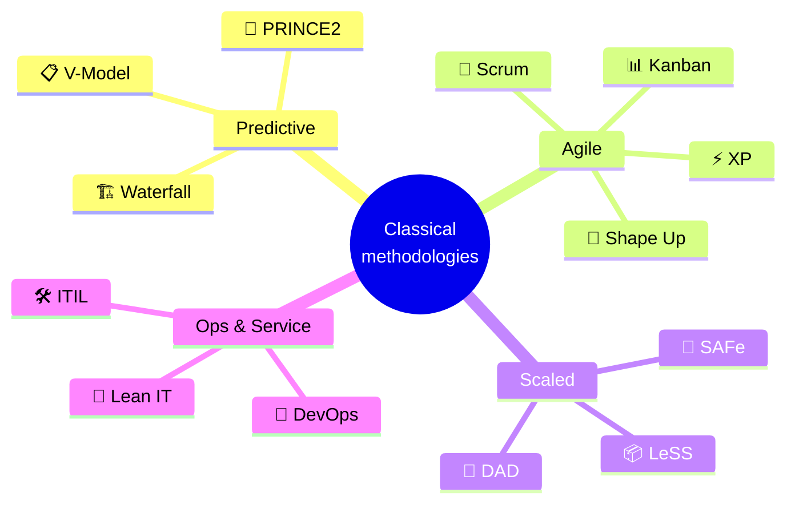
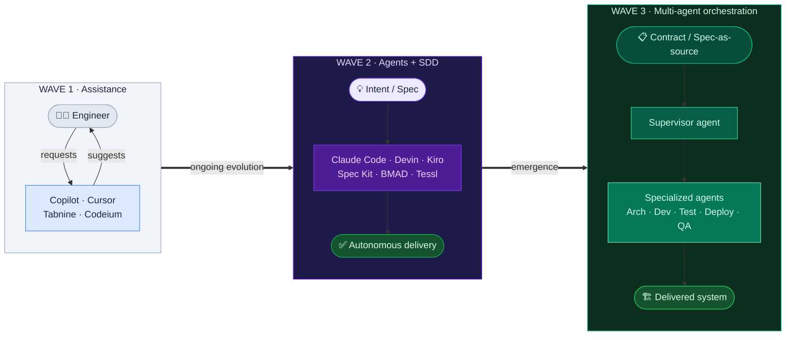
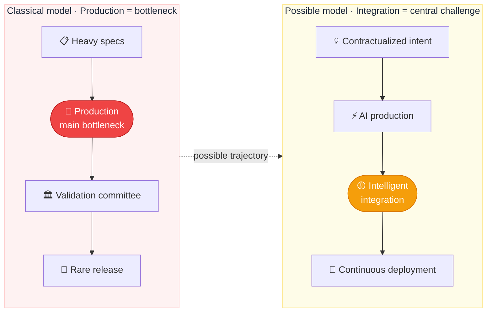
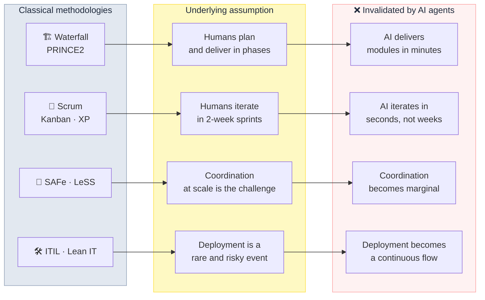
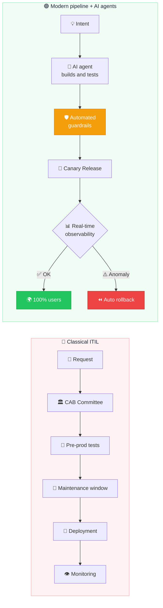
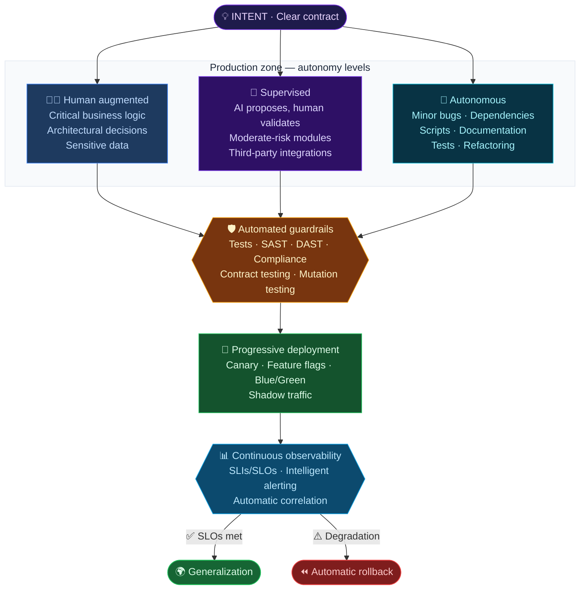
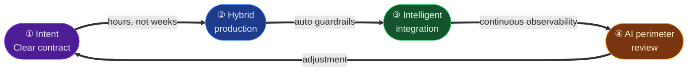
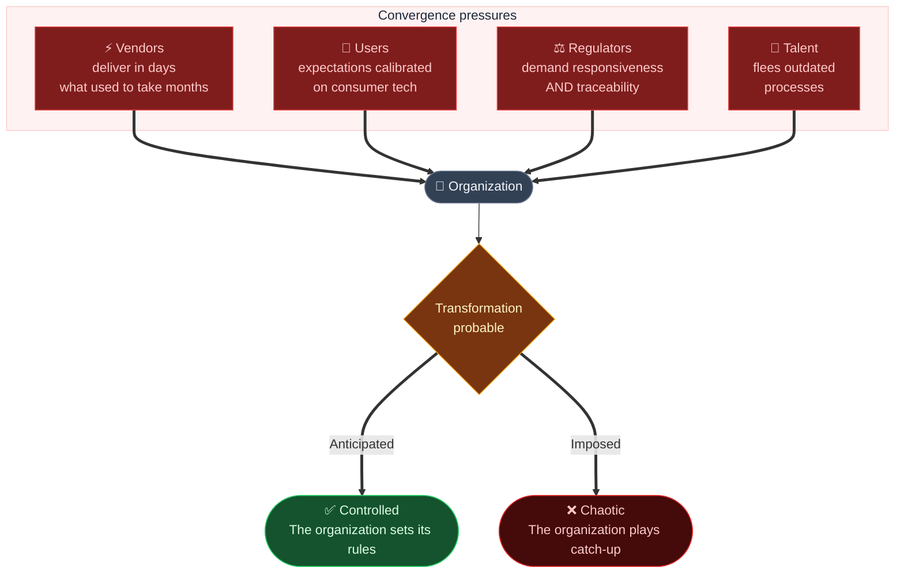

**Languages**  
- 🇬🇧 English (this document) 
- 🇫🇷 Version française: [README-fr.md](README-fr.md)
- 
# Where to converge? Project management in the age of AI agents

> *Open reflection — February 2026*
> *This text does not claim to provide a definitive answer. It proposes a direction and invites discussion.*

---

## Summary

The dominant project management methodologies — Waterfall, Scrum, SAFe, ITIL, Kanban, DevOps — all rest on a founding assumption: **humans are the authors of code, and production takes time**. AI agents (Claude Code, Devin, Antigravity, Cursor Agent, SWE-agent…) are progressively invalidating that assumption. Not tomorrow — today, across a growing number of teams.

Observing these shifts, three fundamental displacements seem to be emerging:

1. **From exhaustive specification → toward clear, contractualized intent**
2. **From upfront validation → toward continuous observability and automated guardrails**
3. **From cadenced sprints → toward continuous flow with differentiated autonomy levels**

This direction is not a rigid framework. It is a **working hypothesis** — a personal reflection on what might emerge, informed by what is already happening on the ground.

---

## 1. The observation: why current methodologies are reaching their limits

### 1.1 The founding assumption that is faltering

Every project management methodology — whether predictive, agile, scaled, or ops-oriented — was designed in a world where **production is the bottleneck**. Every ceremony, every artifact, every validation process exists because development time is scarce and expensive. Planning, estimating, prioritizing, validating: all mechanisms to optimize a limited resource — human production time.

All of these approaches — as different as they are — share a **common fundamental assumption**: humans are the authors of code, and production takes time. The emergence of AI agents challenges this assumption radically.

### 1.2 From assistance to autonomy — a trajectory already underway

The first wave of AI in software development was **assistance**: autocomplete, code suggestion, isolated function generation. The tool remained entirely under the engineer's control — an accelerator, not an actor.

The second wave, already concrete, is that of **autonomous agents**: systems capable of understanding an intent, decomposing a problem into subtasks, writing code, running tests, fixing detected errors, and triggering a deployment pipeline — all without direct human intervention at each step. Teams today use Claude Code, Devin, Antigravity, Aider, or Continue.dev to produce and deploy entire modules autonomously.

This wave is accompanied by the emergence of a new methodological paradigm: **Spec-Driven Development (SDD)** — development driven by specifications. The intuition is simple: if AI generates the code, then **the specification becomes the primary artifact** — the only artifact that humans actually maintain. Code is merely the expression of a spec in a given language and framework. This is a fundamental reversal: in classical development, the spec always ends up diverging from the code. In an SDD world, the spec *is* the source of truth, and code derives from it.

A reference article by Birgitta Böckeler (Thoughtworks/Martin Fowler) usefully distinguishes **three SDD maturity levels**: *spec-first* (the spec is written before the code), *spec-anchored* (the spec is maintained after delivery for evolution), and *spec-as-source* (the spec is the only artifact edited by humans). Most teams today are at the first level, but the trajectory seems clear.

Several concrete approaches already materialize this paradigm:

- **GitHub Spec Kit** (open source, Sept. 2025) — An agent-agnostic toolkit that structures the workflow into steps: *Constitution* → *Specify* → *Plan* → *Tasks* → *Implement*. Compatible with Claude Code, Copilot, Cursor, Gemini CLI, and others.

- **BMAD Method** (open source, v6) — *Breakthrough Method for Agile AI-Driven Development*. Orchestrates a **virtual team of specialized agents** (Analyst, PM, Architect, Dev, QA) following the *Agent-as-Code* paradigm, generating versioned artifacts that serve as shared source of truth between humans and agents.

- **Amazon Kiro** (GA, late 2025) — An agentic IDE that integrates SDD natively. Transforms a prompt into structured specifications, then orchestrates agents for implementation with *hooks* and *property-based testing*.

- **Tessl Framework** (beta, $125M raised) — Pushes SDD toward its most radical form: **spec-as-source**, where code is entirely generated and humans only edit specs.

A third wave is already emerging beyond SDD: **multi-agent orchestrations**, where several specialized agents collaborate on complex tasks — an architect agent, a developer agent, a tester agent, a deployer agent — coordinated by a supervisor agent or declarative interface contracts. BMAD is already a concrete embodiment of this.

### 1.3 The bottleneck has moved

In the classical model, the bottleneck sits in **production**. Methodologies exist to optimize that scarce and expensive time.

With AI agents, the bottleneck shifts toward **integration, validation, and governance**. Production becomes fast and inexpensive. What costs is ensuring that what is produced is correct, safe, compliant, and integrates without regression into an existing system.

This shift has a direct consequence: **coordination ceremonies become disproportionate** relative to the pace of production. Agile ceremonies — sprint planning, refinement, review, retrospective — now represent a disproportionate share of total time, creating a paradoxical inversion: *coordination processes cost more than the work itself*. And when some of that work is completed autonomously by an AI agent while the team is in a planning meeting, the absurdity becomes visible.

### 1.4 A structural mismatch, methodology by methodology

Each classical methodology rests on assumptions that AI agents invalidate:

### 1.5 ITIL: an emblematic case of misalignment

ITIL was designed for stable environments where production deployment is a rare and potentially risky event. Its Change Management process rests on the assumption that deploying is costly to undo.

Yet, if a modern infrastructure allows deploying multiple times a day with automatic rollback mechanisms and real-time observability, prior approval by a change advisory board becomes a structural brake with no proportional added value.

It's not that ITIL is inherently ill-suited — it's that its founding assumptions no longer match the terrain as it evolves. The same reasoning applies, to varying degrees, to each of the classical methodologies.

---

## 2. The convergence direction: Spec-Light, Guardrail-Heavy

Faced with this disruption, it seems to me that organizations don't so much need a new prescriptive methodology as a **convergence vector** — a set of guiding principles that could orient the evolution of practices, regardless of the starting point.

This vector can be summed up in one formula:

> **Less friction in production → More intelligence at integration**

Trust would no longer be granted by a committee upfront. It would be **built through automated proof and real-time observability**.

### 2.1 Five shifts that seem to be emerging

| Shift | In practice |
|-------|------------|
| Exhaustive specification → **clear intent** | Define the *what* and the *why*, not the *how* |
| Upfront validation → **continuous observability** | Detect in 5 min, rollback in 2 min > validate for 3 weeks |
| Manual reviews → **automated guardrails** | Tests, SAST, DAST, compliance as non-bypassable gates |
| All-human → **risk-graded autonomy** | Each component has an explicit autonomy level |
| Cadenced sprints → **continuous flow** | Delivery cadence depends on integration capacity, not ceremonies |

### 2.2 Three coexisting production levels

Convergence doesn't mean delegating everything to agents. It means **explicitly differentiating autonomy levels** based on risk, business criticality, and the maturity of available guardrails.

The autonomy level would depend on factors such as the business impact of an error, data sensitivity, ease of rollback, test coverage, and business logic complexity.

---

## 3. The operational pillars of such a model

### 3.1 The intent contract — specifying better, not less

Moving from exhaustive specifications to intent contracts isn't a simplification — it's a **change of nature**. An intent contract would define the business objective, non-negotiable constraints, the autonomy level granted, and observable acceptance criteria. What disappears: 80-page design documents. What replaces them: a compact contract, actionable by a human *and* by an AI agent. Drafting time: hours, not weeks.

### 3.2 Automated guardrails — trust through proof

In a model where agents produce code autonomously, guardrails are not a luxury — they are the **condition of existence** of the model. Without them, autonomy is chaos in disguise. Code quality, functional correctness, robustness, security, compliance, compatibility: so many automated layers forming a chain of trust. A guardrail failure blocks deployment — no exceptions.

### 3.3 Observability as governance

The deepest shift: in classical methodologies, you control *before* deploying. Here, you would control *during and after* — SLIs/SLOs, intelligent alerting, automatic rollback, complete audit trail.

> If you can detect a problem in 5 minutes and roll back in 2 minutes, the requirement for exhaustive upfront validation loses most of its justification.

### 3.4 Living documentation

Documentation could be **automatically generated** by agents — ADRs, changelogs, API documentation, decision logs. This last category is new: it addresses the **black box risk** inherent in autonomous production.

---

## 4. The operational cycle — four phases, continuous flow

**① Intent** — Define the business problem, expected outcome, constraints, and autonomy level. This is the cycle's only entry point. A vague intent is not compensated by fast production.

**② Hybrid production** — Three modes coexist based on risk: human augmented, supervised, autonomous. No arbitrary timebox — production ends when the intent is realized and guardrails are satisfied.

**③ Intelligent integration** — Validation focuses on *observed results*, not on *forecast plans*. Progressive deployment: canary releases, feature flags, blue/green.

**④ Periodic AI perimeter review** — Regularly, the team reassesses the autonomy perimeters granted to agents. What works is expanded. What drifts is brought back under control. This is the safeguard against the silent normalization of autonomy.

---

## 5. The transition: an intermediate model, not a utopian one

This model is not an idealized end state. It is a **transition hypothesis** — one that could work with today's professionals while preparing the ground for tomorrow's practices.

The arrival of AI agents doesn't just change practices — it reshapes the skills landscape. New roles are already emerging: intent architects, guardrail engineers, agent supervisors, observability engineers. This transformation will be neither instant nor linear — but it's already underway.

---

## 6. The risks — necessary lucidity

Any serious reflection on this topic benefits from integrating its own blind spots.

**Business comprehension debt.** Lightweight specifications can produce applications that are technically coherent but **business-incoherent**. In sensitive contexts — social benefits calculations, personal data, decisions with direct human impact — a business logic error isn't recoverable through a technical rollback. Lighter specs should be compensated by continuous business collaboration, not eliminated.

**Regulatory constraints.** GDPR, algorithmic decision traceability, AI Act: these obligations don't disappear with acceleration. They should be integrated into the guardrails themselves.

**Accountability.** When an agent produces and deploys code, who bears responsibility in case of an incident? It seems reasonable that the team that defined the autonomy perimeter remains responsible. AI autonomy would not be an exoneration — but a supervised delegation.

**The black box risk.** An agent can generate functional code whose internal logic is difficult to audit. Without traceability, a silent **readability debt** accumulates.

**The overconfidence risk.** The most insidious danger: when teams stop questioning agent decisions because "it's been working for 6 months."

---

## 7. External pressure — why the status quo seems hard to maintain

Even organizations that would prefer to change nothing would likely find themselves under pressure — not by conviction, but by **convergence of external forces**.

The history of previous technological revolutions — web, cloud, mobile, DevOps — suggests a recurring pattern: **organizations that anticipate tend to define the new rules. Those that resist often face a forced transformation under unfavorable conditions.**

A few concrete forces that seem hard to ignore:

**Vendors and service providers are accelerating.** Software editors, integrators, and competing startups are adopting these new rhythms. Conservative organizations will find themselves negotiating with partners who deliver in days what they plan in quarters.

**User expectations are evolving.** Employees and clients accustomed to consumer-grade digital products will increasingly reject the gap between their daily digital experience and an organization's internal tools.

**Regulatory pressure itself is evolving.** Regulators are beginning to demand rapid response capabilities: vulnerability patches in hours, adaptation to new laws in weeks. A semi-annual release cycle makes these requirements hard to meet.

**The talent market is shifting.** Engineers trained in modern practices will progressively refuse environments frozen in archaic processes. Organizations slow to evolve risk losing their best people.

Organizations that resist accumulate what might be called a **transformation debt** — one that would make the eventual transition all the more costly and painful.

The question is perhaps less "if" than "how" and "at what pace."

---

## 8. What now?

This document prescribes nothing. It asks a question and sketches a possible direction.

If this reflection has any merit, it may be in naming what is already happening before our eyes: AI agents are changing the game, and methodologies designed for a world where humans are the sole authors of code will need to evolve. The exact form of that evolution remains open.

The **Spec-Light, Guardrail-Heavy** direction is just one hypothesis among others. Other patterns will emerge, driven by teams experimenting today without waiting for a framework to tell them how. That's probably where the best answers lie — in practice, not in theory.

What seems hard to contest, however, is that **the status quo has an expiration date**. The question is not *whether* things will change, but *how* — and at what pace each organization is ready to do so.

---

## Conclusion — a reflection, not a prescription

Current project management methodologies have been excellent for their era. But they rest on an assumption that is being put to the test: *production is slow and costly, and the human is always the author*.

AI agents — Copilot, Cursor, Claude Code, Devin, Antigravity, and their successors — are progressively invalidating this dual assumption. Not only do they accelerate human production, but they are beginning to autonomously produce and deploy entire portions of code. This trend will likely amplify.

The direction sketched here — **Spec-Light, Guardrail-Heavy** — is not yet another framework to stack on top of existing ones. It is a reflection on a possible paradigm shift: moving control levers from upfront validation toward continuous observability, from exhaustive specification toward clear intent, from change advisory boards toward automated guardrails, and from supervising every line of code toward governing autonomy perimeters.

The real challenge will likely be **cultural as much as technical**: accepting that trust is earned through reversibility and observability rather than through upfront approval — whether the code is written by an engineer or by an AI agent.

This model is intentionally **intermediate**: it could work with today's professionals, in organizations as they are, while charting a path toward tomorrow's practices. It does not claim to be the only possible direction — nor necessarily the right one. But it seems to me that a **deliberate, progressive, and reversible** direction is better than no reflection at all.

The question deserves to be asked. And perhaps others will propose better answers.

*This document is an open reflection intended to fuel a discussion on the evolution of project management practices in the age of AI agents.*

*Written with AI assistance — the reflections remain the author's own.*

---

> **Author's note**
>
> If you've made it to this paragraph, then even if this reflection isn't the right one, the question deserves to be asked. This document is neither dogma nor prophecy. It is a personal reflection, imperfect, on a territory still taking shape. If you have a better analysis or a better pattern to propose, the dialogue is open.
